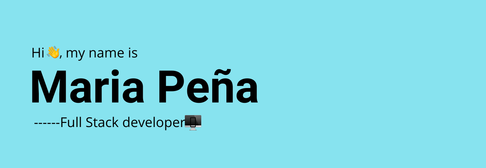

## Table of contents
* [About me - English](#about-me---english)
* [Sobre mi - Español](#sobre-mi---español)
## 👩🏽‍💻About me - 🇺🇸English
I´m a full stack developer and a third year college student majoring in Digital Business. I started coding when I was 17, and haven´t stopped since. I´m experienced in web development and am currently learning mobile development with React Native. I started working as a freelancer this year, after leaving my job as a junior developer in a startup company in Argentina. 
### 💡Skills
- HTML, CSS and JavaScript 
- Angular
- React JS
- Node JS
- SQL
- FireBase
- React Native - Beginner

I also know how to use popular libraries like Bootstrap, Angular Material, Material UI, among others.

### 📕Portfolio
You can check out some of my work here in my profile. I have built landing pages for small busuiness, photography portfolios for friends, a CMS for uploading makeup reviews, music webapps based on Deezers API, and many other small projects where I practice different skills. I´m always trying to learn new things to improve my skills. 

### 📞Contact
Interested in having someone build you a website? Let´s talk!

email: mariapenafd@gmail.com
linkedin: https://www.linkedin.com/in/maria-pe%C3%B1a-721b531a3/

## 👩🏽‍💻Sobre mi - 🇦🇷Español
Soy desarrolladora full stack y alumna de tercer año de la carrera de Negocios Digitales. Empecé a programar cuando tenía 17 años, y desde entonces nunca más paré. Soy avanzada en desarrollo web y estoy actualmente apreniendo desarrollo mobile con React Native. Empecé trabajando como freelancer este año, después de dejar mi trabajo como desarrolladora junior en un startup en Argentina.
### 💡Skills
- HTML, CSS y JavaScript 
- Angular
- React JS
- Node JS
- SQL
- FireBase
- React Native - Principiante

También sé usar librerías populares como Bootstrap, Angular Material, y Material UI, entre otras

### 📕Portafolio
Podes ver algunos de mis proyectos acá en mi perfil. He creado landing pages para empresas pequeñas, portafolios para amigos, un CMS para subir reviews de maquillaje, webapps de musica basadas en la API de Deezer, y muchos otros pequeños proyectos donde practico diferentes habilidades. Siempre estoy tratando de aprender cosas nuevas para mejorar mis habilidades.

### 📞Contact
Te interesa construir tu propia página web? Hablemos!

email: mariapenafd@gmail.com
linkedin: https://www.linkedin.com/in/maria-pe%C3%B1a-721b531a3/

<!--
**mariapenaa/mariapenaa** is a ✨ _special_ ✨ repository because its `README.md` (this file) appears on your GitHub profile.

Here are some ideas to get you started:

- 🔭 I’m currently working on ...
- 🌱 I’m currently learning ...
- 👯 I’m looking to collaborate on ...
- 🤔 I’m looking for help with ...
- 💬 Ask me about ...
- 📫 How to reach me: ...
- 😄 Pronouns: ...
- ⚡ Fun fact: ...
-->
